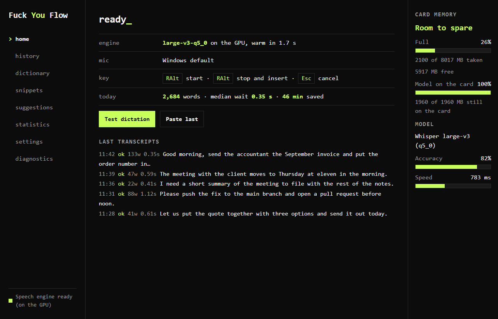
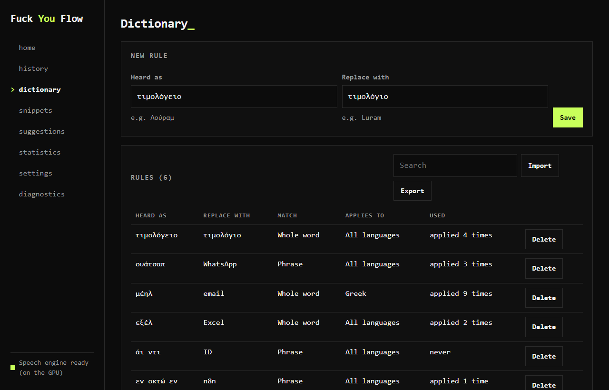

# Fuck You Flow

Free, open-source dictation for Windows 10 and 11, focused on Greek and English.
Press Right Alt, speak, then press it again to insert text into a compatible
Windows text field. The default Whisper engine processes speech on your own PC.

Local dictation works offline after setup, with no account, subscription or word
cap. An optional remote speech provider sends audio to the provider you configure;
its fees and privacy terms apply. The app also checks online for updates, and
destination apps can store or upload text you insert into them.

Made by [Luram AI Agency](https://luram.gr) in Thessaloniki, Greece. Current release:
**v0.9.3 beta**, under MIT.

- [Official website and Windows download](https://fuckyouflow.app/)
- [Ελληνική σελίδα και λήψη](https://fuckyouflow.app/el/)
- [FU Flow vs Wispr Flow](https://fuckyouflow.app/wispr-flow-alternative/)
  and [FU Flow vs OpenWhispr](https://fuckyouflow.app/openwhispr-alternative/)
- [Free offline dictation alternatives](https://fuckyouflow.app/free-offline-dictation-alternatives/)
- [Dictation guides](https://fuckyouflow.app/guides/),
  [οδηγοί στα ελληνικά](https://fuckyouflow.app/el/guides/)
  and [privacy and offline operation](https://fuckyouflow.app/privacy/)



## Why it exists

We wanted a free Windows workflow for local Greek and English dictation, with a
hotkey, editable dictionary and no recurring charge for the local engine. FU Flow
builds that workflow around openly released Whisper models and whisper.cpp.

Other dictation products offer different platforms, models and features. FU Flow
is an independent project; the sourced comparisons above explain the tradeoffs
without claiming to replace every competitor feature.

## What you get

- **Right Alt starts, Right Alt stops.** Press, speak, press again. The text is
  inserted through the normal Windows paste workflow. Escape cancels. Ctrl+Win
  remains available for hold-to-talk, and shortcuts can be changed in Settings.
- **Transcription while you speak.** Finished phrases are processed during
  recording to reduce the work left when you stop. The remaining wait depends on
  the model, speech, hardware, drivers and available memory.
- **Greek and English**, including mixed sentences. Review names and punctuation;
  recognition can make mistakes.
- **Rule-based cleanup.** Rules can remove filler words, apply spoken corrections
  such as "Τρίτη, όχι όχι, Παρασκευή", and add question marks from the wording.
  They can misinterpret speech, so review the result before sharing it.
- **A dictionary you control.** Save recurring corrections as editable rules.
  When learning from edits is enabled, suitable History edits produce suggestions
  you can accept or dismiss. This does not retrain Whisper or guarantee that a
  word will always be recognized correctly.
- **Snippets.** Say a phrase, get a block of text.
- **History, statistics and per-application styles**, all on your disk.
- **Local speech processing by default.** The local adapter talks to an engine
  process on the same PC. Selecting the optional remote provider uploads audio
  instead. The app attempts to reject detected password fields; this is not a
  guarantee that every sensitive field can be identified.

Some applications, protected documents or elevated windows can refuse automatic
paste. Copy the transcript from History and paste it manually if needed. Local
history and clipboard contents can be read by someone with access to the PC;
local recognition does not make a cloud document or conversation offline.



## Install

Download the installer from
[Releases](https://github.com/Breakzoras/fuck-you-flow/releases) and run it. The
v0.9.3 full installer is about **1.7 GB to download**, including the speech models.
This is the installer size, not a verified installed-disk minimum. Allow additional
space for installation, local models, history and updates. The installer uses
per-user installation mode.

The beta installer is unsigned, so Windows may show a "Windows protected your PC"
dialog. Use the linked project release and compare its published SHA256 checksum
before deciding whether to continue through "More info" and "Run anyway".

The full installer includes the Vulkan speech engine, large-v3 and turbo models,
and the voice activity detector. Supported AMD, Intel and NVIDIA cards can use
Vulkan; a CPU fallback is available. Compatibility and speed vary by device and
driver. Initial setup examines the machine to select a model and thread count;
review the selection in the Speech models tab in Settings.

The app checks for available updates after startup. Downloading an update waits
for your choice. Local dictation does not require a successful update check.

## Speed

Four recorded maker observations on an RTX 3070 with `large-v3-q5_0`, measuring
the wait after finishing dictation until text appeared:

| Words | Speech | Wait |
|---:|---:|---:|
| 32 | 17.5 s | 0.59 s |
| 108 | 82 s | 0.17 s |
| 179 | 77 s | 0.53 s |
| 312 | 152 s | 0.88 s |

These are project measurements, not a controlled comparison with Wispr Flow,
OpenWhispr or another product, and not a promise of subsecond results on every PC.
The last phrase is one source of remaining work; total recording length, model
state, memory pressure and other running applications can also affect the wait.
See the [model benchmark summary](eval/bench-summary.md) for separate recognition
accuracy and processing-time measurements on the project's test corpus.

An earlier engine comparison on that machine used one 5-second Greek phrase with
`large-v3-q5_0`: Vulkan 593 ms, CUDA 663 ms, processor alone 12.5 s. Those figures
describe that setup. Shipping Vulkan support does not establish equal speed on
AMD, Intel and NVIDIA cards. A smaller model or CPU fallback has its own tradeoffs;
test a short dictation on your machine before relying on it.

## Speaking well

Speak at a comfortable pace and check the transcript. Microphone quality, noise,
pronunciation and model choice affect recognition. Practical things to try:

- A short pause between sentences can help the engine separate phrases. It does
  not guarantee punctuation or a particular processing time.
- Pronounce the last word of a sentence fully, especially Greek word endings.
- Names and foreign words: say them clearly and in one piece.
- Check question marks after dictation. You can try saying "ερωτηματικό" as an
  explicit punctuation command, then review the result.
- With self-correction cleanup enabled, try "όχι όχι" followed by the right word.
  Check that the intended correction was applied.

## Build it yourself

Requirements: Rust stable, Node 20 or newer, pnpm, the Visual Studio C++ build
tools. See [docs/DEV-SETUP.md](docs/DEV-SETUP.md).

```bash
pnpm install
pnpm tauri dev
```

Always build through the Tauri CLI. A plain `cargo build --release` produces a
development binary that looks for the interface on a dev server.

## Documentation

- [docs/USER-GUIDE.md](docs/USER-GUIDE.md) in Greek
- [docs/ARCHITECTURE.md](docs/ARCHITECTURE.md)
- [docs/THREAT-MODEL.md](docs/THREAT-MODEL.md)
- [docs/QUESTION-RULES.md](docs/QUESTION-RULES.md), the Greek grammar rules
- [docs/KNOWN-LIMITATIONS.md](docs/KNOWN-LIMITATIONS.md), read this before
  reporting a bug
- [docs/THIRD-PARTY-NOTICES.md](docs/THIRD-PARTY-NOTICES.md)

## Contributing

Issues and pull requests are welcome. The parts that most need other people's
machines: applications that refuse a paste, keyboard layouts, older processors,
and Greek words the dictionary should know.

## License

MIT. See [LICENSE](LICENSE). The speech engine and the models carry their own
licenses, listed in the third-party notices.

FU Flow is independent of Wispr Flow and OpenWhispr. Third-party components retain
their own licenses and attribution requirements.
